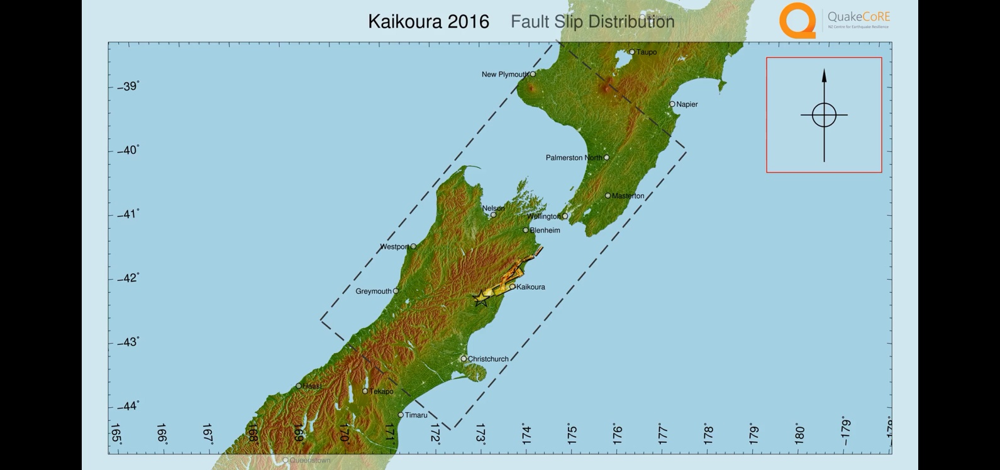
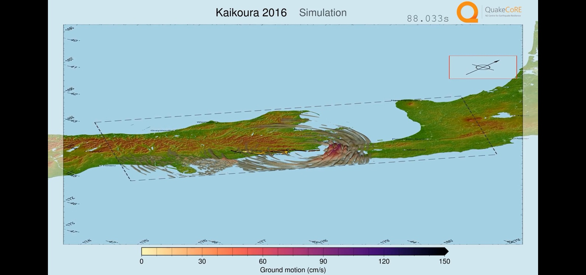
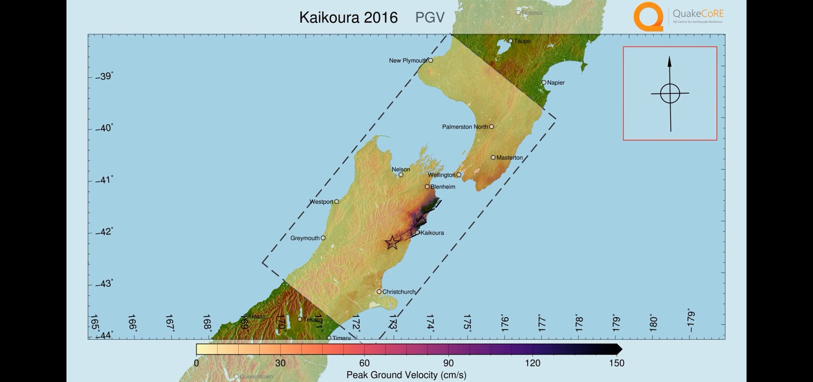
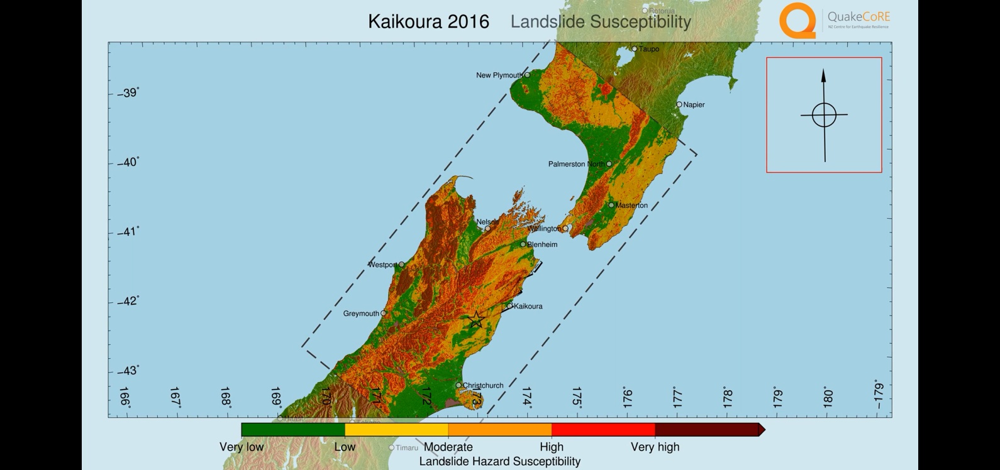
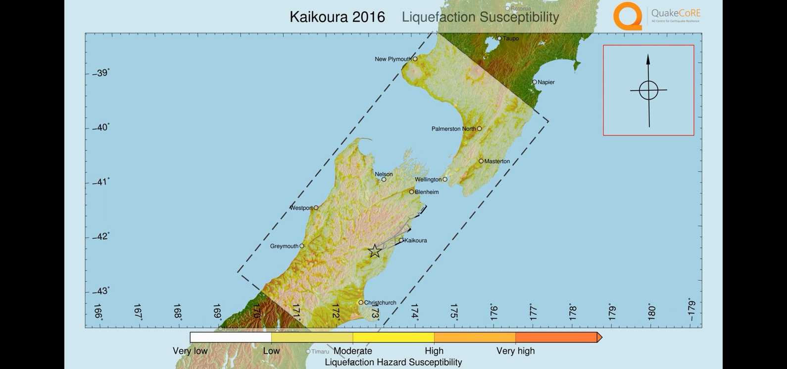
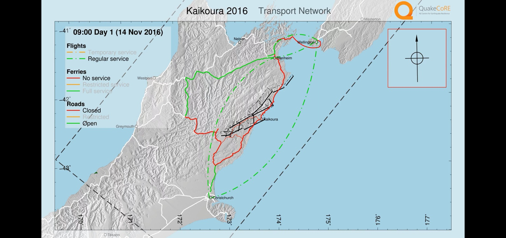

# GMSimViz
Automated 3D Visualization of Ground Motion Simulation with Generic Mapping Tools(GMT)

----------

## Table of contents
   * [Overview] (#overview)
   * [Installation] (#installation)
   * [Tutorial] (tutorial.md)
   * [Issues & Bug Reports] (#issues--bug--reports)
   * [Sample Data] (#sample-data)
   * [Dependencies] (#dependencies)
   * [Thanks] (#thanks)

## Overview
GMSimViz is an automation tool that produces an animated 3D visualization of geological faults, ground motion and other earthquake related data. It uses the Generic Mapping Tools(GMT) to create individual frames, and join them by FFmpeg to create a movie file.

A fully featured result is available at https://youtu.be/qZkOTI4x_cc








## Dependencies
* Python (>=2.6) tested with 2.7
* Numpy for Python 2 (>= 1.10) tested with 1.10 and 1.13
* MPI4Py for Python 2 and associated backend
* H5Py for Python 2 and associated backend
* GMT (>=r19922) requires release after 5.4.3 (currently unavailable) versions prior to r19922 will have bugs but GMSimViz is designed to work with GMT (>=5.2) tested with Ghostscript 9.18, 9.21 was found to produce glitches
* FFMpeg built with image2/png, h.264 encoder support (standard installation) tested with version 3.3
* Qcore library (self-contained)


## Installation
The GMSimViz script requires the installation of dependencies before running.
### Linux
Install the packages for the above mentioned dependencies (qcore library instructions later). Names vary between distribution repositories. For purposes of an example, the package names on Debian are given:\
python2.7 python-numpy python-mpi4py python-h5py gmt ffmpeg

At the time of writing, there is no bug-free version of GMT >= 5.2 for the scope of GMSimViz. It is expected that releases after 5.4.3 will work. Install development versions from the repository, instructions available at http://gmt.soest.hawaii.edu/projects/gmt/wiki/BuildingGMT . Works with r19922 but will likely break in the future with significant changes.

Download and extract the plotting resource zip file available at:\
https://mega.nz/#!v9wHTTrI!WKE0qZAE8sC0dpKrpEx1skt4y8YBVeQhY6UlqGKlt6c

The qcore library is installed with the following command in the repository root (requiring root priviledges). **Before installing**, edit the `qcore/config.json` file so that `GMT_DATA` has the full path to the resources folder from the step above.
```shell
python2 setup.py install
```
On systems where `python2` does not point to the Python 2 installation, try `python` instead.

### Other systems
Currently Unsupported

## Issues & Bug Reports
It is strongly recommended to use the latest version of GMT directoy obtained from its subversion repository. The latest verified revision  is r19922. Other versions are found to have issues with certain features that GMSimViz depends on.

## Sample Data
Sample data is provided, it contains smaller data sets from multiple earthquakes to make a feature-full demo. To produce the sample animation with 8 processes, run the following from the repository location upon installation:
```shell
./GMSimViz.py sample_data/fault.srf -a --crude -n7 --title "Sample Animation" --dpi 120 --downscale 1 -x sample_data/xyts.e3d --liquefaction-s sample_data/liquefaction_s.hdf5 --liquefaction-p sample_data/liquefaction_p.hdf5 --landslide-s sample_data/landslide_s.hdf5 --landslide-p sample_data/landslide_p.hdf5 --paths sample_data/transport
```
If you don't have `python2` in your `env`, you may need to run with `python2 GMSimViz.py` or `python GMSimViz.py` instead of `./GMSimViz.py`.\
Most parameters in the above example are optional. Some provide more segments in the animation, others have defaults. Here is a summary of the sample command options:

- `srf_file` first position, not optional. Path to a fault in standard rupture format containing the plane header (https://scec.usc.edu/scecpedia/Standard_Rupture_Format).
- `-a` create animation instead of static image showing the slip distribution only. Will animate the progression of slip if no other input data are given.
- `--crude` this will produce a quick result. No topography or roads are plotted, low resolution coastlines are used and overlays have lower resolutions.
- `-n28` number of slave (worker) processes to start. 7 is a good choice for systems with only 8 cores. It is recommended to run on a machine with many cores.
- `-f10` set the framerate.
- `--title` title on the movie, the default is the basename of the SRF file.
- `--dpi` dpi of output. Frames are 16 inches x 9 inches so 240 will produce 4k output.
- `--downscale` render at higher resolution and then downscale. Prevents jitter in object positioning. 8 is ideal for a smooth result.
- `-x` XYTS file. This is an output created by the EMOD3D software that simulates ground motion. This provides the simulation domain and ground motion data.
- `--liquefaction-s` and `--landslide-s` Liquefaction and/or landslide suceptibility HDF5 file. Must have data under `model` as in given sample data.
- `--liquefaction-p` and `--landslide-p` As above for the probability from given event.
- `--paths` Transport network in GMT path format with optional GMT legend files as given in sample data.

The sample animation takes about 45 minutes with -n7 on a v4 E5-2620 (2.1 GHz). Slave processes are spawned after about 3 minutes and frames will start appearing in the temporary folder (in the same folder as the SRF file, sample_data/_GMT_WD_PERSPECTIVE_<random sequence>). When complete, the video is available in the working directory and the temporary folder is removed by default.

For details on more parameters, run:
```GMSimViz.py -h```

## Thanks

The QuakeCoRE team would like to thank:

Eric Thompson from USGS for collaborating with us and providing data and software relating liquefaction and landslide analysis.\
The Generic Mapping Tools team, especially Paul Wessel for GMT support and quickly fixing issues we ran into while using GMT.
