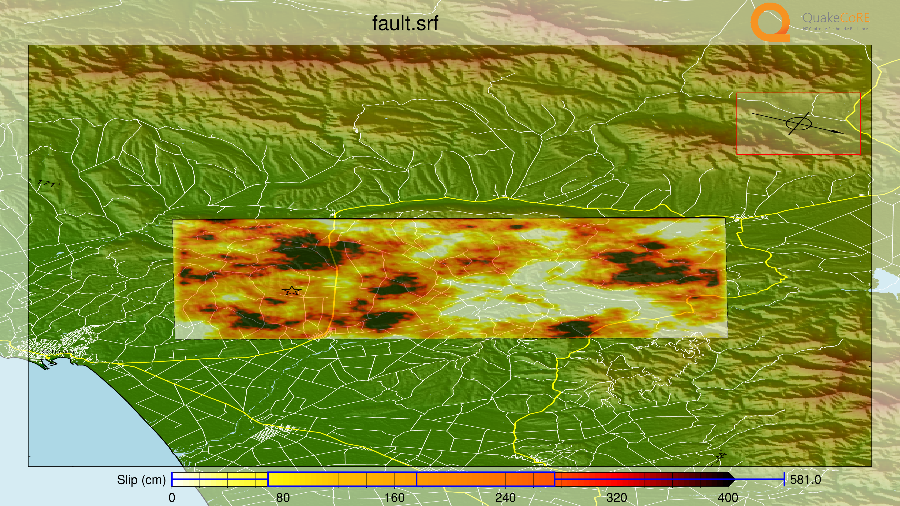

# GMSimViz: Automated 3D Visualization of Ground Motion Simulation with Generic Mapping Tools (GMT)

## Overview
GMSimViz is an automation tool that produces an animated 3D visualization of geological faults, ground motion and other earthquake related data. It uses the Generic Mapping Tools(GMT) to create individual frames, and join them by FFmpeg to create a movie file.

A fully featured result is available at https://youtu.be/qZkOTI4x_cc

<table style="width:%">
  <caption>Screenshots of a GMSimViz-generated animation</caption>
  <tr>
    <th></th>
    <th></th>
  </tr>
  <tr>
    <td></td>
    <td></td>
  </tr>
  <tr>
    <td></td>
    <td></td>
  </tr>
</table>


## Installation

### Dependencies
The GMSimViz depends on the following software packages.

* Python (>=2.7) tested with 2.7 and 3.6. Which version do I have? Run `/usr/bin/env python --version`.
* Numpy (https://www.numpy.org https://pypi.org/project/numpy/) for Python version (>= 1.10) tested with 1.10, 1.13 and 1.14
* MPI4Py (https://bitbucket.org/mpi4py/ https://pypi.org/project/mpi4py/) for Python version and mpi backend (https://www.open-mpi.org dependency of mpi4py)
* H5Py (http://www.h5py.org/ https://pypi.org/project/h5py/) for Python version and hdf5 backend (https://support.hdfgroup.org/HDF5/ dependency of h5py)
* GMT (>=r19922) requires release after 5.4.4 (currently unavailable) versions prior to r19922 will have bugs but GMSimViz is designed to work with GMT (>=5.2) tested with Ghostscript 9.18, 9.21 was found to produce glitches
* FFMpeg built with image2/png, h.264 encoder support (standard installation) tested with version 3.3
* gawk

For testing:

* pytest with pytest-mpl and matplotlib
* imageio (tested with 2.1.1) or scipy prior to 1.2 with pillow.

### Linux
Install the packages for the above mentioned dependencies. Names vary between distribution repositories.  On Ubuntu or other Debian-based Linux distributions, most of the packages can be installed by the following command. If your system default Python is version 3, install the `python3-*` packages instead of `python-*`.
```shell
sudo apt install python2.7 python-numpy python-mpi4py python-h5py ffmpeg gawk git
```
If you are using a Debian based distribution, you will also need to have installed the separated -dev packages in order to compile GMT.
```shell
sudo apt install libpng-dev
```
#### GMT

GMT version earlier than 5.2 has some outstanding issues to work reliably with GMSimViz. A version later than 5.4.4 is recommended, and at the time of writing, the latest development source obtained directly from the  repository (A release r19922 fully verified, r20495 also seems fine).  Instructions for GMT installation is available at http://gmt.soest.hawaii.edu/projects/gmt/wiki/BuildingGMT . You should compile with PNG support enabled (check configure output, make sure headers are available).

If you want to use the latest stable release at time of writing, versions 5.4.3 and 5.4.4 will draw outlines of the fault plane and hypocentre location on the surface rather than at depth (bug) but otherwise work fine.

Make sure the `gmt` binary is in the PATH. If `gmt` is installed in `/usr/local/bin` and `gmt` is not already available in the PATH, add it to the PATH:
```shell
export PATH=$PATH:/usr/local/bin
```
You can add the line above to `~/.bashrc` to make it persistent.


#### GMSimViz

Download GMSimViz:
```shell
git clone git@github.com:ucgmsim/GMSimViz.git
```

Download the plotting resource GMSimViz_resources.zip file from https://goo.gl/mYFCQn
Extract this file to where GMSimViz is located so that GMSimViz/resources exists.

Install with the following command.
```shell
sudo python setup.py install
```
In case of no root priviledge, `--user` option can be used.

```shell
python setup.py install --user
```
You may use `python2`, `python3`, `python2.7` etc. instead of `python` where you want to use a specific verision.

### Other systems
On Mac OSX, GMT can be installed from homebrew (https://brew.sh/).


## Sample Data
Sample data is provided, it contains smaller data sets from multiple earthquakes to make a feature-full demo. 

GMT may produce error messages like the one below in versions from around 5.4.4 with GMSimViz. These can be ignored.
```shell
grdimage: Error: (x_max-x_min) must equal (NX + eps) * x_inc), where NX is an integer and |eps| <= 0.0001.
grdimage (gmtlib_read_grd_info): Use grdedit -A on your grid file to make region and increments compatible [GMSimViz/resources/Topo/srtm_all_filt_nz_i5.grd]
grdimage: Error: (x_max-x_min) must equal (NX + eps) * x_inc), where NX is an integer and |eps| <= 0.0001.
grdimage (gmtlib_read_grd_info): Use grdedit -A on your grid file to make region and increments compatible [GMSimViz/resources/Topo/srtm_all_filt_nz.grd]
```

The most simplest output is a single frame (image) facing the fault plane. This case only requires the SRF file as the parameter:

```shell
gmsimviz sample_data/fault.srf
```
The output will be in the current directory with the same basename as the SRF file but with `_perspective.png` added to the end.

An animation can be created from an SRF that shows the rupture propagating. It can be expected to take around 12 minutes to complete on a decent personal machine. Here is an example using 7 slave processes for a machine with 8 cores (including hyperthreading). An example of what is expected is available at https://youtu.be/nTtq_DxGVUM
```shell
gmsimviz sample_data/fault.srf -a --crude -n7 --title "Fault Animation" --dpi 120 --downscale 1
```
Animations will be saved in the current working directory with the same name as the SRF file but with a `.m4v` extension. `./fault.m4v` in the above and below examples.

The fully featured sample animation below takes about 45 minutes with -n7 on a v4 E5-2620 (2.1 GHz). Slave processes are spawned after about 3 minutes and frames will start appearing in the temporary folder (in the same folder as the SRF file, sample_data/_GMT_WD_PERSPECTIVE_<random sequence>). When complete, the video is available in the working directory and the temporary folder is removed by default. The expected output is available at https://youtu.be/6TFj5HXp3MU
```shell
gmsimviz sample_data/fault.srf -a --crude -n7 --title "Sample Animation" --dpi 120 --downscale 1 -x sample_data/xyts.e3d --liquefaction-s sample_data/liquefaction_s.hdf5 --liquefaction-p sample_data/liquefaction_p.hdf5 --landslide-s sample_data/landslide_s.hdf5 --landslide-p sample_data/landslide_p.hdf5 --paths sample_data/transport
```

Here are details for command options:

- `srf_file` not optional. Path to a fault in standard rupture format containing the plane header (https://scec.usc.edu/scecpedia/Standard_Rupture_Format).
- `-a` create animation instead of static image showing the slip distribution only. Will animate the progression of slip if no other input data are given.
- `--crude` this will produce a quick result. No topography or roads are plotted, low resolution coastlines are used and overlays have lower resolutions. This is required for faults outside of the New Zealand area because the higher resolution topography is only available here. Alternatively, replace the topography files in the resources directory with your own.
- `-n` number of slave (worker) processes to start. Minimum is 1, 7 is a good choice for systems with only 8 cores. It is recommended to run on a machine with many cores.
- `-f` set the framerate of the animation eg: 30. The minimum is 5 and each frame is independent so a framerate of 60 would take roughly twice as long as 30.
- `--title` title on the movie, the default is the basename of the SRF file. In the screenshots at the top of the page, the title is "Kaikoura 2016".
- `--dpi` dpi of output. Frames are 16 inches x 9 inches so 240 will produce 4k output, 120 for FullHD.
- `--downscale` render at higher resolution and then downscale. Prevents jitter in object positioning. 8 is ideal for a smooth result.
- `-x` XYTS file. This is an output created by the EMOD3D software that simulates ground motion. This provides the simulation domain and ground motion data. The XYTS file format is described [here](./XYTS.md)
- `--liquefaction-s` and `--landslide-s` Liquefaction and/or landslide suceptibility HDF5 file. Longitude and latitude is stored as an array under 'x' and 'y' respectively. `model` is a 2D array containing the actual values in the shape (y, x).
- `--liquefaction-p` and `--landslide-p` As above for the probability from given event.
- `--paths` Folder containing transport network in GMT path format (with .gmt extention, colour and pen data in path headers) with optional GMT legend files (same basename with .legend extention). Files are sorted numerically, underscore separators can be used. Sample data provided.
- `--gm-cut` Cut the time series of the xyts file given with `-x` short to this many seconds. Eg if the xyts timeseries is 300 seconds but nothing happens after 200, use --gm-cut 200.
- `-t` Sets the time (s) for major animation transitions such as when originally facing the slip distribution from initial camera position.
- `-m` Sets the minor tranition time (s) for transitioning between different segments of the animation.
- `-p` Sets the time (s) to pause for when showing an image such as fault under ground and liquefaction/landslide images.
- `-d` Sets the delay (s) at the start of the animation before the camera starts moving.
- `-e` Sets end delay (s) at the end of the animation to prevent sudden end after moving the camera.
- `-r` Fix the rotation of the camera to bearing (deg). eg: 0 to face north always.
- `--temp` Continue from the given previous temporary directory, will not re-render frames which are complete.
- `-k` Keeps the temporary directory (containing all frames) once animation is complete.

To list the parameters, run:
```gmsimviz -h```

## Thanks

The QuakeCoRE team would like to thank:

* Eric Thompson from USGS for collaborating with us and providing data and software relating liquefaction and landslide analysis.
* The Generic Mapping Tools team, especially Paul Wessel for GMT support and quickly fixing issues we ran into while using GMT.
